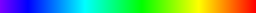
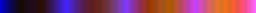
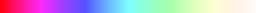
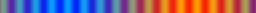
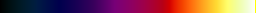

# glsl-colormap

A collection of GLSL fragment shaders to draw color map like this:

.

# usage

Each `*.frag` shader sources provide a `colormap` function, which takes an `foat` argument `x` (`x` should be: `0.0 <= x <= 1.0`). `colormap` function returns `vec4` value which represents a RGBA color.

```
/* include "rainbow.frag" here, for example. */

void main() {
    gl_FragColor = colormap(gl_TexCoord[0].x);
}
```

# samples

|name            |sample                          |
|----------------|--------------------------------|
|rainbow         |         |
|apricot         |         |
|carnation       |       |
|ether           |           |
|grayscale_banded||
|hot_metal       |       |
|lava_waves      |      |
|malachite       |       |
|seismic         |         |
|space           |           |

# license

The MIT License.
