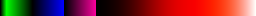
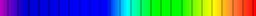
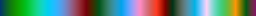
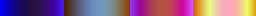

# glsl-colormap

A collection of GLSL fragment shaders to draw color map like this:

.

# usage

Each `*.frag` shader sources provides a `colormap` function, which takes an `float` argument `x` (`x` should be: `0.0 <= x <= 1.0`). The `colormap` function returns a `vec4` value which represents an RGBA color.

```
vec4 colormap(float x);

void main() {
    gl_FragColor = colormap(gl_TexCoord[0].x);
}

/* include "shaders/rainbow.frag" here, for example. */
```

## special case

### gnuplot.frag

This shader emulates `gnuplot`'s `rgbformulae`, and the signature of `colormap` is:
```
vec4 colormap(float x, int red_type, int green_type, int blue_type);
```

It takes additional 3 arguments, with same meanings to `rgbformulae`'s 3 arguments respectively.

# usage from c++

```c++
#include <colormap/colormap.h>
#include <iostream>

int main()
{
    using namespace colormap;

    // Print RGB table of MATLAB::Jet colormap.
    MATLAB::Jet jet;
    std::cout << "category: " << jet.getCategory() << std::endl;
    std::cout << "title:    " << jet.getTitle() << std::endl;
    int const size = 256;
    for (int i = 0; i < size; ++i) {
        float const x = i / (float)size;
        Color c = jet.getColor(x);
        std::cout << x << "\t" << c.r << "\t" << c.g << "\t" << c.b << std::endl;
    }

    // Dump category and title of all colormaps.
    for (std::shared_ptr<Colormap const> const& c : ColormapList::getSharedList()) {
        std::cout << c->getCategory() << " : " << c->getTitle() << std::endl;
    }
    return 0;
}
```

# samples

## MATLAB

* http://www.mathworks.com/products/matlab/

|name          |sample                       |
|--------------|-----------------------------|
|MATLAB\_autumn||
|MATLAB\_bone  |  |
|MATLAB\_cool  |  |
|MATLAB\_copper||
|MATLAB\_hot   |   |
|MATLAB\_hsv   |   |
|MATLAB\_jet   |   |
|MATLAB\_parula||
|MATLAB\_pink  |  |
|MATLAB\_spring||
|MATLAB\_summer||
|MATLAB\_winter||

## gnuplot

* http://www.gnuplot.info/

|name                   |sample                          |
|-----------------------|--------------------------------|
|rgbformulae(7, 5, 15)  |  |
|rgbformulae(3, 11, 6)  |  |
|rgbformulae(23, 28, 3) | |
|rgbformulae(21, 22, 23)||
|rgbformulae(30, 31, 32)||
|rgbformulae(33, 13, 10)||
|rgbformulae(34, 35, 36)||

## IDL

* http://www.exelisvis.com/ProductsServices/IDL.aspx

|name                         |sample                                     |
|-----------------------------|-------------------------------------------|
|IDL\_Black-White\_Linear     |     | <!-- #0 -->
|IDL\_Blue-White\_Linear      |      | <!-- #1 -->
|IDL\_Red\_Temperature        |        | <!-- #3 -->
|IDL\_Blue-Green-Red-Yellow   |  | <!-- #4 -->
|IDL\_Standard\_Gamma-II      |      | <!-- #5 -->
|IDL\_Prism                   |                  | <!-- #6 -->
|IDL\_Red-Purple              |             | <!-- #7 -->
|IDL\_Green-White\_Linear     |     | <!-- #8 -->
|IDL\_Green-White\_Exponential|| <!-- #9 -->
|IDL\_Green-Pink              |             | <!-- #10 -->
|IDL\_Blue-Red                |               | <!-- #11 -->
|IDL\_16\_Level               |               | <!-- #12 -->
|IDL\_Rainbow                 |                | <!-- #13 -->
|IDL\_Steps                   |                  | <!-- #14 -->
|IDL\_Stern\_Special          |          | <!-- #15 -->
|IDL\_Haze                    |                   | <!-- #16 -->
|IDL\_Pastels                 |                | <!-- #18 -->
|IDL\_Hue\_Sat\_Lightness\_1  |    | <!-- #19 -->
|IDL\_Hue\_Sat\_Lightness\_2  |    | <!-- #20 -->
|IDL\_Hue\_Sat\_Value\_1      |        | <!-- #21 -->
|IDL\_Hue\_Sat\_Value\_2      |        | <!-- #22 -->
|IDL\_Purple\-Red\+Stripes    |     | <!-- #23 -->
|IDL\_Beach                   |                  | <!-- #24 -->
|IDL\_Mac\_Style              |              | <!-- #25 -->
|IDL\_Eos\_A                  |                  | <!-- #26 -->
|IDL\_Eos\_B                  |                  | <!-- #27 -->
|IDL\_Hardcandy               |              | <!-- #28 -->
|IDL\_Nature                  |                 | <!-- #29 -->
|IDL\_Ocean                   |                  | <!-- #30 -->
|IDL\_Peppermint              |             | <!-- #31 -->
|IDL\_Plasma                  |                 | <!-- #32 -->
|IDL\_Blue-Red\_2             |             | <!-- #33 -->
|IDL\_Rainbow\_2              |              | <!-- #34 -->
|IDL\_Blue\_Waves             |             | <!-- #35 -->

## transform

* http://web.archive.org/web/20000520021207/http://www.fortner.com/docs/product_transform.html

|name                      |sample                                 |
|--------------------------|---------------------------------------|
|transform\_rainbow                   |                |
|transform\_apricot                   |                |
|transform\_carnation                 |              |
|transform\_ether                     |                  |
|transform\_grayscale\_banded         |       |
|transform\_hot\_metal                |              |
|transform\_lava\_waves               |             |
|transform\_malachite                 |              |
|transform\_seismic                   |                |
|transform\_space                     |                  |
|transform\_morning\_glory            |          |
|transform\_peanut\_butter\_and\_jerry||
|transform\_purple\_haze              |            |
|transform\_rose                      |                   |
|transform\_saturn                    |                 |
|transform\_supernova                 |              |


# license

The MIT License.
